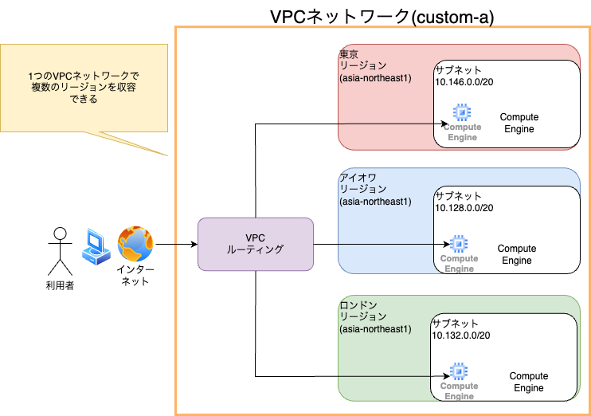

# VPC

## 26 GoogleCloudのネットワーク

### GoogleCloudの巨大なネットワーク

google検索やGmail、YouTubeといったGoogleのサービスを支える巨大なネットワークインフラは、
毎年巨額の投資が行われており、より高いパフォーマンスを目指して日々進化を続けています。
Google Cloudのネットワークには、Googleのサービスを支えるネットワークと同じものが使用されています。
Google Cloudのネットワークには、次のような特徴があります。

* より安全により高速に

Google独自の技術によって最適化された、グローバルでハイパフォーマンスなネットワーク、安全に利用できます。

* 拡張性と柔軟性

 googleのネットワークは多くの機能が、ソフトウェアによってネットワークを定義する技術である
 SDN (Software Defined Network)よって実現されており、高い拡張性と柔軟性があります。

### Googleのネットワークサービスを理解するには

本書の内容を理解するには、リージョンを選ぶポイントを押さえておく必要があります。
多くのGoogle Cloudのサービスは、初期設定にリージョンやゾーンを指定する必要がありますが、
これは、これから解説するネットワークサービス(VPC)でも同様です。
「 **エンドユーザーから物理的に最も近いリージョンはどこか**」「 **海外のリージョンを利用しても良いのか**」といった内容を事前に調査して、どのリージョンゾーンでホストするのかを決める必要があります。

### GoogleCloudにおけるデフォルトの設計

google Cloudでは何らかのサービスの利用する際、いきなり高度なネットワーク設定をユーザに求める事はありません。
リソースの作成と同時に、ネットワークの設定を裏側で行ってくれるサービスがほとんどです。
ユーザがよりスピード感を持って使えるよう、また注力したい部分にコストを避けるように様々な工夫がされています。
「**すぐ試したい**」「**まずは小さなスケールで検証したい**」といった場合は、デフォルトの設定を使って作りたいシステムが実現できそうかを判断すると良いでしょう。

### まとめ

* **google CloudはGmailやYouTubeと同じネットワークインフラを使用している**
* **googleクラウドのネットワークには、安全で拘束高い拡張性と柔軟性などの特徴がある**
* **ネットワークサービスを理解するには、リージョンやゾーンの理解が必須**

## 27 VPC 仮想ネットワークサービス

### VPCとは

 Virtual Private Cloud(VPC)は、 google Cloud内に論理的に構成された仮想ネットワークを提供するサービスです。
VPCは、 クラウド上のリソースやサービスに、グローバルなネットワーキングを提供します。
また拡張性と柔軟性に優れており、セキュアなネットワークの設定が簡単に行えます。
ここでは、VPCに用意されている機能を紹介します。
クラウドに限らず、インフラの運用経験がある人には、お馴染みの機能もあるでしょう。

* VPCの機能一覧

| サービス名 | 概要 |
| --- | --- |
| VPCネットワーク | GoogleCloud内に構成される仮想ネットワーク |
| 外部IPアドレス | 主にインターネットへのアクセスに使うIPアドレス(外部IPアドレス) |
| ファイアウォール | 接続の許可または拒否を行う |
| ルート | ルーティングの設定 |
| VPCネットワークピアリング | VPCネットワーク同士の接続 |
| 共有VPC | 異なるプロジェクトでVPCを共有 |
| サーバーレスVPCアクセス | サーバーレスなGoogleCloudサービスからのVPCへの接続 |
| パケットのミラーリング | 検査用にトラフィックのクローンを作成 |

### VPCネットワーク

 VPCネットワークとは、 google Cloud内に構成される、仮想ネットワークのことです。
VPCの中心となる機能で、VPC ネットワークのことを指してVPCと呼ぶ場合もあります。
VPCネットワークは、Andromedaと 呼ばれるGoogle独自の技術を活用したネットワークです。
VPC ネットワークを使用すると、複数のサブネットをルーターで接続した、物理ネットワークと同等のグローバルネットワークが構成可能です。
なお、1つのVPCネットワークには複数のリージョンを収容できます。

### Google Cloudのコンピューティングサービスをつなぐ

VPC ネットワークは主に、コンピューティングサービスである**ComputeEngineインスタンス**や**Google Kubernetes Engine(コンテナ)**、**App Engineフレキシブル環境**に対するネットワーキングを提供します。
仮想マシンやコンテナを作成または起動すると、作成時に紐付けられたVPCネットワークのサブネットのIPアドレスから、 内部IPが自動的に割り当てられます。
この内部IPが割り当てられることで、マシン同士の通信が可能になります。
なお、VPCネットワーク内の特定の内部IPを固定的に割り当てることも可能です。

### リソース同士の通信

仮想マシン などのリソース同士は、同じVPCネットワークを使用していれば、
 異なるサブネットに属していても特別なルーティングの設定なしに通信が可能です。
しかし、異なるVPCネットワーク間で通信を行いたい場合は、**VPCネットワークピアリング**の設定が必要です。(他にもCloud VPNを使った接続方法などがあります)

### まとめ

* **VPCは、 google Cloudの論理的に構成された仮想ネットワークを提供するサービス**
* **VPC ネットワークとは、Google Cloud内に構成される仮想ネットワークのこと。**
* **同じVPC ネットワークを使用していれば、異なるサブネットに属していても特別なルーティングの設定なしに通信が可能**

## 28 デフォルトネットワーク

### 「default」という名前のVPCネットワーク

Google Cloudでプロジェクトを作成すると、自動で「default」と言う名前のVPCネットワーク(以下、デフォルトネットワーク)が作成されます。
デフォルトネットワークでは、あらかじめ各リージョンにサブネットが用意されています。
同じVPCネットワークに属するリソースなら、異なるサブネットの間でも特別なルーティングの設定なしに通信が可能です。
そのためデフォルトネットワークを使えば、リージョンをまたいだグローバルの通信がすぐに行えます。
VPCをリージョンごとに作成して、各ネットワークをつなげる(ピアリングをする)といった作業は不要です。

### デフォルトネットワークなら初期設定が不要

google Cloudのリソースの多くは、作成時にVPCネットワークを選択が必要です。
「ひとまずGoogleリソースを試してみたい」といった場合は、デフォルトネットワーク使用すればすぐに動作確認を始められます。
なお、リソースを作成する際は、使用するネットワーク設定を変更しない限り、デフォルトネットワーク選択されます。
ただし、デフォルトネットワークは、IPアドレスが事前に割り当てられている点や、
新しいリージョンができた場合も新しいIPアドレスが自動的に割り当てられるといった点で柔軟性に欠けるので本番環境では自動でVPCネットワークを作ることをおすすめします。

### まとめ

* **プロジェクトを作成するとデフォルトネットワークが作成される**
* **デフォルトネットワークでは、あらかじめ各リージョンにサブネットが用意されている**
* **ひとまず試したい場合は、デフォルトネットワークを使用すると良い。**

## 29 サブネット

### サブネットとは

サブネットとは、あるネットワークを分割した小さなネットワークのことです。
ネットワークの分割とは、ネットワークのIPアドレスを論理的に分割することを指し、これを「サブネット化」といいます。
またサブネットは、IPアドレスのあとに「/24」といった数字を書くCIDR表記と呼ばれる方法で表記します。
この数字によって、IPアドレスの範囲を表現します。

### GoogleCloudにおけるサブネット

GoogleCloudでは、サブネットはVPCネットワーク内に定義します。
またサブネットはリージョンリソースです。リージョンリソースとは、必ずどこかのリージョンに属する必要があるリソースのことです。
つまり、サブネットは必ずどこかのリージョンを指定する必要があります。
また、サブネットは複数のゾーンに跨って使用できます。
なお、サブネットは1つのVPCネットワークに複数作成できますが、同じVPCネットワークに、IPアドレス範囲が重複するサブネットは作成できません。

### サブネットはロケーションに依存する

作成した仮想マシンなどのリソースに適用するサブネットは、リソースを利用したいロケーション(地域)と同じにする必要があります。
そのため、リソースを配置したいリージョンと同じリージョンに紐づくサブネットを、リソースを作成する前に用意しておく必要があります。
例えば、日本に住む人をメインターゲットにしたアプリケーションを構築する場合を考えてみましょう。
仮想マシンに保存するデータも日本に置きたい場合は、東京リージョンか大阪リージョンに事前にサブネットを作成する必要があります。
ただし、前節で紹介したデフォルトネットワークを使用すれば、各リージョンにサブネットが自動生成されているので、すぐに試すことができます。
もし、デフォルトネットワークが作成されていない場合、VPCネットワークを作成する際に、利用目的に応じてサブネットを作成するモードを選択する必要があります。

### まとめ

* **サブネットはVPCネットワーク内に定義する**
* **サブネットはデータを保存したいロケーション(地域)と同じにする必要がある**

## 30 VPCネットワークの2つのモード
VPCネットワークを作成する際、サブネットを自動でさくせいするかカスタマイズするかを選べます。
目的に応じて適切な方法を選べるようになるために、それぞれの特徴やユースケースを理解しておきましょう。

### VPCには２つのモードがある

VPCネットワークには、各リージョンのサブネットを自動で作成する自動モードVPCネットワークと、ユーザーがサブネットの範囲を決めてカスタマイズするカスタムモードVPCネットワークがあります。
VPCネットワークを作成する際、どちらかのモードを選択する必要があります。
GoogleCloudのサービスをすぐに試したい場合は、自動モードVPCネットワークを利用すると良いでしょう。
また、本番環境構築には、カスタムモードVPCネットワークが推奨されます。
なお、一度カスタムモードVPCネットワークを選択すると、自動モードVPCには変更することはできないので注意しましょう。
自動モードVPCネットワークに変更するには、そのVPCネットワークを削除して、作り直す必要があります。

| モード | 特徴 |
| --- | --- |
| 自動モードVPCネットワーク | 各リージョンのサブネットを自動で作成する |
| カスタムモードVPCネットワーク | ユーザーがサブネットの範囲を決めてカスタマイズする |

###  自動モードVPCネットワークの使い所

自動モードVPCネットワークのユースケースを紹介します。

* **各リージョンにサブネットが自動で作成されると便利な場合**
自動モードにしておけば、GoogleCloudに新リージョンが追加されても、自分でサブネットを追加する手間が省けます。
* **特定のIPアドレスが必要ない場合**
特定の目的でIPアドレス範囲を確保する必要がないなら、自動モードで問題ないでしょう。
* **手軽にGoogleCloudを始めてみたい場合**
サブネットが自動で作成されるので、手軽にGoogle Cloudを始められます。

### カスタムVPCネットワークの使い所

カスタムVPCネットワークのユースケースを紹介します。

* **各リージョンにサブネットを自動的に割り当てる必要がない場合**
特定のリージョンの見使う際は、カスタムモードにするのも1つの手です。
* **割り当てるIPアドレスの範囲を、カスタマイズする必要がある場合**
高度なネットワーク設定を行いたい場合（本番環境など）には適しています。
* **VPCネットワーク間を接続したい場合**
自動モードVPCネットワークのように、同じIPアドレス範囲を利用しているVPC同士は接続できないため、VPCネットワーク間を接続したい場合は、カスタムモードを使用します。

### まとめ

* **VPCネットワークには、自動モードVPCとネットワークカスタムモードVPCがある**

## 31 ファイアウォール
ネットワーク通信を制御するには、ファイアウォールは必須ともいえるサービスです。
GoogleCloudでも、ファイアウォールを使ってリソース間の通信制御を行えます。
ファイアウォールを設定する際の項目や、対象と紐づける方法についても解説します。

### ファイアウォールとは

 ファイアウォールとは、コンピュータやネットワークとの通信を、管理者などが設定したポリシーに従って、許可または拒否するセキュリティ機能のことです。
 例えば、クラウドの外からアクセスしてくるユーザーの端末と仮想マシン(ComputeEngine)間のネットワーク通信を制御できます。
 あるいは、仮想マシンや、仮想マシン上で稼働するサービス(GoogleKubernetesEngineクラスタやAppEngineフレキシブル環境など)といったリソース間のネットワーク通信を制御することもできます。
 
 ### ファイアウォール　ルール

 GoogleCloudでは、ユーザーが定義した ファイアウォールルールを利用して、ComputeEngineやComputeEngineといったGoogleCloudのサービスへのアクセスを制御できます。
 制御対象外のプロトコルには、TCP,UDP,ICMP,AH,ESP,SCTPなどが指定できます。
 プロトコルとは、送受信の方法やデータの表現方法といった、通信する際のルールのことです。
 なお、GoogleCloudではファイアウォールルールの有無に関係なく、外部IPアドレスのTCP25(SMTP)を宛先とする通信は許可されません。
 ファイアウォールを作成するには、次の項目を入力します。

* ファイアウォール　ルールの項目

| 項目 | 説明 |
| --- | --- |
| 名前 | ファイアウォールルールの名前 |
| 説明 | ファイアウォールルールの説明 |
| ログ | Cloud Loggingにログを出力するかどうかを設定する |
| ネットワーク | 対象のVPCネットワーク |
| 優先度 | ほかのファイアウォールルールとの優先度 |
| トラフィックの方向 | トラフィックの上り/下り |
| 一致した時のアクション | トラフィックの許可/拒否 |
| ターゲット | ファイアウォールルールの対象範囲(すべての仮想マシン、指定されたターゲットタグ、指定されたサービスアカウント) |
| 送信元/宛先フィルタ | 特定のIPアドレス範囲にルールを適用するフィルタのこと。上りトラフィックのファイアウォールルール　ルールにはソースタグ、サービスアカウントも選択可能 |
| プロトコルとポート | ルールを設けるプロトコルとポート番号 |

### ファイアウォールルールには優先度を設定できる

ファイアウォールルールは、複数設定することが可能です。
そのため、ファイアウォールルールに優先度を設定できます。
ファイアウォールルールには「まず全てのアクセスを禁止した上で、その上で必要なものを個別に許可する」という考え方があります。

### ファイアウォールルール　ルールでは上りか下りかを指定する

GoogleCloudのファイアウォールルールを作成する場合、トラフィックの上り(外部からのリソースに対してのアクセス)と下り(リソースから外部に対してのアクセス)を指定します。
送受信のそれぞれにルールを設定する場合は、上りのルールと下りのルールを別個に作成します。

### ファイアウォールルール ルールと対象の紐付け

ファイアウォールルールと対象の仮想マシンを紐づけるには、 ターゲットタグを使います。
ファイアウォールルールルールで指定するターゲットタグとして、対象の仮想マシンのネットワークタグを指定することで、紐付けができます。
また、対象の仮想マシンの役割ごとにネットワークタグを用意して、ファイアウォールを使い分けることが可能です。
1つの仮想マシンに対して複数のネットワークタグが定義でき、同様にファイアウォールにおいても複数のターゲットタグを指定できます。
また、VPCネットワーク上のすべての仮想マシンに適用したり、指定のサービスアカウントに適用したりといった姉弟も可能です。

* ターゲットタグにネットワークタグを指定して紐付け

### 送信元/宛先フィルタ

送信元/宛先フィルタでは、特定のIPアドレス範囲を送信元/宛先としたルールを適用するフィルタを設定します。
送信元/宛先のIPアドレスを指定する「IP範囲」や上りのファイアウォールルールの場合は、タグのついたソースからのトラフィックのみを許可する「ソースタグ」を指定して、設定します。

### デフォルトのファイアウォールルール

プロジェクトを作成した際に作成されるデフォルトネットワークには、デフォルトのファイアウォールルールが存在します。
このルールには、上りに対して優先度が一番低く設定された以下のルール名が存在します。

* デフォルトのファイアウォールのルール

| ルール名 | ターゲット | プロトコルとポート | 概要 |
| --- | --- | --- | --- |
| default-allow-ssh | 全てに適用 | TCPポート22 | SSH接続の許可 |
| default-allow-rdp | 全てに適用 | TCPポート3389 | リモートデスクトップ接続の許可 |
| default-allow-icmp | 全てに適用 | ICMP | ICMPプロトコルの許可 |
| default-allow-internal | 全てに適用 | TCPポート0〜65535 UDPポート 0〜65535 | 内部IPに対してのルール |

内部IP同士の通有心許可である「default-allow-internal」というファイアウォールルール以外は、任意の送信元である「0.0.0.0/0」がIP範囲として定義されます。これは広い範囲でのky他となり、セキュリティ脅威になります。
アクセスを制限するためにもユーザー自身で不ァイアウォールルールの定義を行い、デフォルトの定義ファイアウォールを無効化することをお勧めします。

### まとめ

* **ファイアウォールは、コンピュータやネットワークとの通信をポリシーに従って許可または拒否するセキュリティ機能**
* **ユーザーが定義したファイアウォールルールを利用してアクセス制御できる**

## 32 VPCネットワークの拡張

