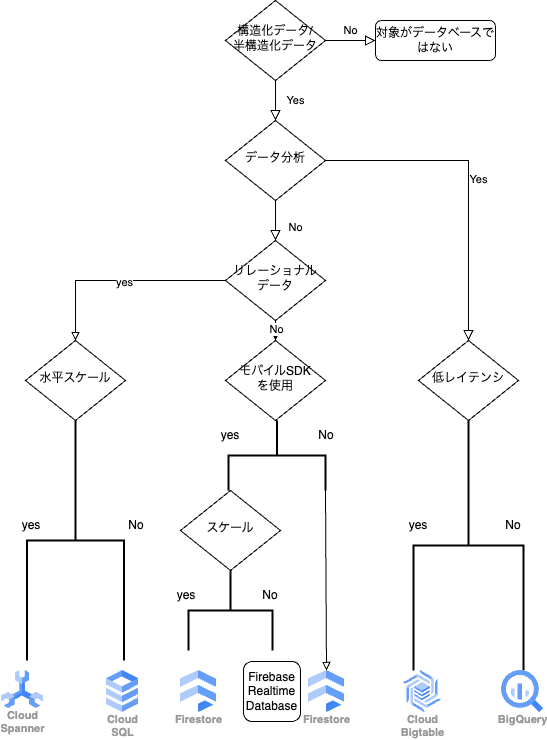

# データベースサービス

## 55 データベースとは
システムを構築する際、データベースは欠かせない存在です。
GoogleCloudでは、さまざまなデータベースが提供されていますが、サービスを紹介する前にまずはデータベースとは何か解説しましょう。

### データベースとは

データベースとは、検索や蓄積が用意にできるように整理されたデータの集合体のことです。しすてむでは、さまざまなデータを扱います。通販サイトやSNSなどを考えてみると、ユーザー情報や購買履歴、ブログ記事、画像など、実にさまざまなデータを扱っていることが用意にできるでしょう。これらのデータを保存するのに使うのがデータベースです。
システムやアプリケーションを構築するのに必須の知識と呼べます。これらのデータベースを管理するシステムのことをデータベースマネジメントシステム(DBMS)と言います。代表的なDBMSにはMySQLやPostgreSQL、Oracle Databaseなどがあります。
データベースからデータを取得するといいたことが簡単にできます。

### リレーショナルデータベースとNoSQLデータベース

データベースには、大きく分けてリレーショナルデータベース(RDB)とNoSQLデータベースがあります。
RDBは、データを表形式として管理するデータベースです。表と表の関係(リレーション)を定義できるので、データの複雑な関係性を扱えます。
また、データベースに対する操作はSQLと呼ばれる言語を使用します。
NoSQLのデータベースは、RDBの対義語として使われている言葉です。NoSQLデータベースの中にはさまざまな方式があり、特定のデータベースの仕組みを指すものではありません。いずれもデータベースへのアクセスにSQLを使用しないので、総称として「NoSQLデータベース」と呼びます。
一般的にNoSQLは単純なデータ構造で保存するため、高速にアクセスできます。
データを保存する仕組みとして代表的なものに、キーバリューストアやドキュメント型があります。

### まとめ

* **データベースとは、検索や蓄積が容易にできるように整理されたデータの集合体のこと**
* **データベースにはRDBとNoSQLがある**

## 56 GoogleCloudのデータベースサービス
ここからは、GoogleCloudのデータベースについて見ていきます。
さまざまなサービスが用意されているので、サービスの詳細を見る前にまずは全体像を掴みましょう。

### GoogleCloudのデータベースサービス

GoogleCloudでは、さまざまなデータベースサービスが提供されています。
それぞれ、RDBやNoSQLデータベースといった種類や用途が異なります。

* GoogleCloudのデータベースサービス

| サービス | 種類 | 用途 |
| --- | --- | --- |
| Cloud SQL | RDB | トランザクション型。結合や複雑なクエリが可能。 |
| Cloud Spanner | グローバル分散機能を備えたRDB | トランザクション型。結合や複雑なクエリ、無制限なスケーリングが可能。 |
| Cloud Bigtable | NoSQL(列指向型) | 低レイテンシで高スループット |
| FireStore | NoSQL(ドキュメント型) | Google Cloudサービスとのシームレス結合。Webモバイルアプリ、IoTアプリに使われる。 |
| Firebase Realtime Database | NoSQL(ドキュメント型) | リアルタイム同期が可能。クライアントデバイスから直接アクセスできる |
| Memory store | NoSQL(キーバリューストア) | オープンソースのRedis/Memcachedと完全互換 |
| Bigtable | データウェアハウス | 大規模なデータセット保存やクエリ実行が可能。 |
| BareMetal Solution | RDBを稼働させるためのソフトウェア | 特殊ワークロードで利用する。低レイテンシでGoogleCloudサービスと結合しアクセス可能。Oracle Databaseなどを導入可能なベアメタルサーバーを提供 |

### データベースサービスの選択基準

実際にGoogleCLoudのデータベースを利用する場合、サービスの種類が多いのでどのサービスを使うべきか迷うことがあります。
選択基準のフローチャートは次のとおりです。

### Google Cloud データベースへの移行

既存のデータベースをGoogleCloudに移行する場合、以下のサービスが対応しています。

* データベースの対応

| 既存のデータベース | Google Cloudのデータベースサービス |
| --- | --- |
| MySQL | Cloud SQL for MySQL |
| PostgreSQL | Cloud SQL for PostgreSQL |
| SQL Server | Cloud SQL for SQL Server |
| HBase | Cloud Bigtable |
| Redis | Memorystore for Redis |
| Oracle Database | Bare Metal Solution |

なお、オンプレミスのMySQLやPostgreSQLからGoogleCloudのCloudSQLへ移行するには、Database Migration Serviceというサービスを使うと簡単に行えます。

### まとめ

* GoogleCloudではさまざまなデータベースサービスが提供されている
* データベースサービスごとにRDBやNoSQLデータベースといった種類や用途が異なる

## 57 CloudSQL

GoogleCloudの代表的なデータベースサービスである、CloudSQLを解説しましょう。
CloudSQLは、作成から接続まで、とても簡単に行えます。
表形式のデータを扱いたい場合は、まず候補として考えられるサービスです。

### CloudSQLとは

Cloud SQLは、GoogleCloudで提供されているRDBサービスです。AWSで言うと、Amazon RDSに相当するサービスです。
CloudSQLは、セットアップと管理が容易なフルマネージドサービスで、セキュリティや柔軟なスケールング、素早いプロビジョニングを実現し舞うs。セキュリティ面では、送信中・保存中のデータを暗号化する仕組みのほかに、VPCによるプライベートIP(内部IP)での接続や、ユーザー認証などの仕組みがあります。
また、標準の接続ドライバが用意されているので、初めて利用する場合でも作成から接続までを簡単に行えます。

### Cloud SQLで使用できるDBMS

CloudSQLで使用できるDBMSはMySQL、PostgreSQL、SQL Serverの３種類です。

### Cloud SQLのマシンタイプ

Cloud SQLでは、選択できるマシンタイプが、DBMSごとに異なります。
マシンタイプとは、用途別にまとめられた仮想ハードウェア(vCPU数やメモリ容量)のことです。
MySQLの場合は、事前に定義されたカスタムマシンタイプ(共有コア、軽量、標準、ハイメモリ)もしくは、「カスタム」から選択可能です。

### Cloud SQLの料金

Cloud SQLの料金はComputeEngineのようにvCPU数とメモリ容量で変わりますが、どのDBMSを選択するかによっても違います。Cloud SQLにおけるvCPU数とメモリ容量は、事前に定義されたマシンタイプか「カスタム」のマシンタイプで選択した値になります。

### CloudSQLを使用する方法

CloudSQLの使用を開始するのは非常に簡単です。
GoogleCloudコンソールからインスタンス作成画面を開いて設定オプションでマシンタイプとストレージを選択することでインスタンスを作成できます。

### CloudSQLに接続する方法

CloudSQLに接続するには、パブリックIPを使用する方法があります。

#### パブリックIPを使用して接続

最小限の設定でCloudSQLのインスタンスを作成した場合、インスタンスは
パブリックIPを利用して接続するように構成されます。外部からインターネット経由でこのインスタンスに接続すr場合は、「認証済みのネットワーク」の「ネットワーク追加」から接続元のIPアドレスを登録することが必要です。接続クライアントが多数存在して、認証済みネットワークを追加する作業が煩わしい場合は、Cloud SQL Auth Proxy(Cloud SQLへ安全にアクセスするアプリケーション)を利用します。CloudSQLAuthProxyを使うと「認証済みのネットワーク」を使用することなく、セキュアに接続できます。

#### プライベートIPでの接続

CloudSQLではパブリックIPではなく、プライベートIPでも接続可能です。
接続ポイントをインターネットに公開することなく接続できるので、パブリックIPよりセキュリティ的に安全です。プライベートIP接続を行う構成でインスタンスを作成した場合、接続できる範囲は同じVPCや共有VPC内に存在するクライアントやサーバー、CloudVPN、Cloud Interconnectで接続したオンプレミスネットワークになります。

### まとめ

* CloudSQLはGoogleCloudで提供されているRDBサービス
* CloudSQLで使用できるのは、MySQL、PostgreSQL、SQLserverの３種類
* DBMSごとに選択できるマシンタイプが異なる

## 58 NoSQLデータサービス

GoogleCloudでは、RDBだけでなくNoSQLのデータベースもサービスとして提供されています。
ここでは、サービスごとのメリットやユースケースも含めて見ていきましょう。

### Cloud Bigtable

CloudBigtableは、GoogleCloudで提供されているフルマネージドな、キーバリューストア型のデータベースサービスです。th大規模データを高速に処理できるのでデータ処理や分析などの向いています。
Google検索やYouTube、Googleマップなど、Googleのサービスの基盤に利用されていることでも知られています。
データ処理や分析に向いているデータベースにはBigQueryもありますが低レイテンシが特徴であるCloudBigtableは、より高い応答性能が求められる分析に向いています。CloudBigtableには次のような特徴もあります。

#### HBase API規格サポート

HBaseAPI規格(標準的なApache HBaseインターフェイス)をサポートしているため、現環境でHadoop(大規模データの分散処理を行うフレームワークのこと)などを利用している場合は、移行に関わるアプリケーションのコードを変更を少なくすることが可能です。

#### 低レイテンシと高スループット

大量のデータをキーバリュストアとして保存することで、低レイテンシで高スループットな読み取りと書き込みを実現しています。ノードを追加してスケールするとQPS(秒間クエリ数)を増やすこともできます。

#### シームレスなスケール

CloudBigtableのノード追加は、再起動を行わずに実施可能です。
大量のデータを処理する際にノードだけを動的に追加し、不要になったタイミングで元のノード数に戻せます。
ノードの追加や削減時にダウンタイムが発生しないため、必要なタイミングで必要な分だけノードを確保できます。

### FireStoreとは

FireStoreとは、GoogleCloudで提供されている、Webアプリとモバイルアプリのための、スケーラビリティが高いNoSQLデータベースです、GoogleCloudコンソールから作成する際、ネイティブモードもしくはDataStoreモードを選択する必要があります。
１つのプロジェクトで、ネイティブモードとDatastoreモードの両方を使用することはできません。
GoogleCloudにはもともとDatastoreというサービスがありましアガ、現在は、Firestoreの「Datastoreモード」が後継サービスとして提供されています。
これ以降は、単に「Firesotore」の場合はネイティブモードを表し、「Datastore」の場合はDatastoreモードを表すものとします。

### Firestoreの特徴

Firestoreは、Firebase製品(Googleが提供するもモバイル・Webのバックエンドサービス)の１つです。サーバーを介さずに、クライアントから直接アクセス可能です。
REST APIやRPC API、ネイティブSDKから直接アクセスできるので、自分でAPIサーバーなどを構築せずに、データへアクセスできます。
FireStoreには、次のような特徴もあります。

#### ドキュメント型

Firestoreはドキュメント型のNoSQLデータベースです。コレクションやドキュメントという概念でデータを保存するので、柔軟にデータの検索を行えます。

#### トランザクション

1つ以上のドキュメントの読み書きに対してトランザクションを実行するので、データの整合性が取れます。

#### クライアント/サーバからのアクセス

サーバークライアントライブラリが提供されており、WebやiOS、Androidなどのクライアントからのアクセスだけではなく、サーバーサイドからのアクセスも可能です。

#### リアルタイム同期

複数のデバイスによりリアルタイム同期が可能となっております。オフライン時にはデバイスのローカルストレージに永続化を行い、オンライン復帰時に同期を行います。

### Datastoreの特徴

Datastoreはすべてのクエリで強整合性を保証しており、RDBと同様で、更新直後からすべて最新のデータであることが保証されます。
以前のDatastoreは、クエリの種類によって更新直後は最新の結果が返ってくるとは限らない「結果整合性」と「強整合性」が分かれていました。FireStoreのDatastoreモードに変わったことで、強整合性が保証されるようになりました。強整合性が保証されたことによって、モバイルクライアントライブラリやWebクライアントライブラリが必要な場合はネイティブモード、それ以外の場合はDataStoreモードで使い分けることが出来るようになりました。

#### エンティティグループによるデータモデル

Datastoreは、キーとバリューを組み合わせてデータを保存するキーバリューストア型のデータベースです。事前に保存するデータの形式を定義する必要がなく、アプリケーションの要件に応じて、データの形式をあとから自由に変更できます。また、一般的なキーバリューストアと違うのは、エンティティグループという独自の仕組みで、データ同士を紐づけできる点です。

#### FireStoreとの非互換性

FireStoreAPIやクライアントライブラリは、Databaseモードでは使用できません。また、Firestoreのリアルタイム機能も使用できません。

### Firebase Realtime Database

Firebase Realtime Databaseは、GoogleCloudで提供されている、リアルタイム同期型データベースです。データはJSONとして保存され、接続されているクライアントとリアルタイムで同期できます。
iOSやAndroidなどクロスプラットフォームでアプリを構築した場合でも、すべてが１つの同じインスタンスを共有して最新のデータを受信することが可能です。なお、データ同期はHTTPリクエストではなく、WebSocketを利用して行われ、データが更新されるたびに、接続されているすべてのデバイスが数ミリ秒以内に更新されます。
たとえば、iOSのデバイスで更新したデータは、AndroidやほかのiOSデバイス上のアプリに同期されることで参照できます。

#### オフライン時にデータを永続化

オフライン時、FirebaseRealtimeDatabaseSDKはデータをローカルストレージへ永続化します。
オフラインからオンラインに復帰し接続が確立されると、クライアントはサーバーと同期を行い、不足している情報を更新します。

#### クライアントからの直接接続

サーバーを介さず、デバイスやWebブラウザから直接アクセスが可能です。

#### スケーリング

Blazeプラン(従量制プラン)を利用すると、複数のデータベースインスタンスを分割でき、大規模なデータへの対応を行えます。

### まとめ

* Cloud Bigtableは、キーバリューストア型データベース
* FireStoreは、スケーラビリティが高いNoSQLデータベース

## 59 そのほかのデータベース

GoogleClooudには、そのほかにもデータベースサービスが提供されています。
ここではインメモリデータベースのMemorystoreと、RDBとNoSQLのいいとこどりをしたデータベースであるCloudSpannerを紹介します

### Memorystoreとは

Memorystoreは、GoogleCloudが提供する、スケーラブルで安全かつ高可用性を実現した、インメモリデータベースサービスです。インメモリデータベースとは、データをインメモリ(RAM上)に保存するデータベースのことです。
従来のディスクへアクセスするデータベースとは異なり、データをメモリ上で扱うため高速にアクセスできます。メインメモリに保存するため揮発性のデータになりますが、ハードディスクに永続化することも可能です。セッション情報の保存やリアルタイム分析、ゲームのランキング情報の取得など、高速なアクセスが必要なデータを取り扱うケースに向いています。
Memorystoreでは、オープンソースのインメモリーデータベースであるRedisとMemcachedに完全互換のMemorystore for RedisとMemorystore for Memcachedの２種類が用意されています。

### Memorystore for Redis

Memorystore for Redisには、次のような特徴があります。

#### フルマネージドなサービス

フルマネージドで提供されているので、障害検出やフェイルオーバーなども自動で行われます。
そのため、自前で運用する場合と比較して、運用コストを抑えられます。

#### 高可用性の実現

Memorystore for Redisのインスタンスには「標準階層」と「基本階層」の２種類があります。
「標準階層」を選択すると、複数ゾーンでレプリケーションが行われます。また、障害検出時は自動でフェイルオーバーも行われ、高可用性を実現します。「基本階層」を選ぶとレプリケーションは行われません。

#### 容易なスケーリング

Memorystore for Redisでは、ミニマムスタートし、使用するニーズが変わった際に変更すると言う使い方が可能です。容量は、最大300GBまでスケールします。なお「標準階層」で作成したインスタンスをスケーリングする場合は、１分未満のダウンタイムで実施できます。

### Memorystore for Memcached

Memorystore for Memcachedはベータ版の提供のみでしたが2021年2月に一般提供となりました。Memorystore forMemcachedは次のような特徴があります。

#### インスタンスのサイジング

１ノードあたり使用できるvCPUは1〜32個、メモリは1〜256GBまでの間であり、1GB刻みで作成できます。

#### スケーリング

ノード数の増減で水平スケーリングが可能です。垂直スケーリングを行いたい場合は、インスタンスの再作成が可能です。

#### サポート対象サービス

Compute Engine, GKE, Cloud Functions, App Engine スタンダード環境、App Engine フレキシブル環境から接続可能です。なお、Cloud Runからの接続は現在サポートされていません。

### Cloud Spannerとは

CloudSpannerとは、GoogleCloudで提供されているRDBの強整合性とNoSQLのスケーリングの特徴を組み合わせたデータベースのことです。
CloudSpannerは、RDBを利用しつつ、アクセス増加が見込めるタイミングにあわせて柔軟にスケーリングを行えるため、ゲームサービスのようなバックエンドサービスに向いています。CloudSpannerには次のような特徴もあります。

#### RDB機能を搭載

スキーマやSQL ACIDトランザクションといった、RDBの機能が搭載されています。

#### 高可用性

マルチリージョンの構成で99.999%の可用性を実現しています。
この可用性を維持しつつ、グローバルで迅速なスケーリングを実現します。

#### 自動シャーディング

不可やデータサイズに基づいて自動的にシャーディング(水平分割)を行います。
シャーディングとは、データを複数のノードに分割し保存し、スループットを上げる手法のことです。
一般的なRDBではクラスタを作成してシャーディングを行いますが、CloudSpannerならその手間を省けます。

### Cloud Spannerの制約

SQLやACIDトランザクションといったRDBの機能を含むCloudSpannerですが、次のような制約が存在します。

#### 自動採番機能

自動採番が採用されていませんん。また、単調に増加するシーケンシャルな値を主キーとして使用することは推奨されておらず、ランダムなUUIDが推奨されています。
CloudSpannerは、主キーの値に応じてデータを分散保存するため、シーケンシャルな主キーを用いると、データが複数のノードに均一に分散されずデータの偏りが発生します。そうするとリクエストがノードに集中するので、パフォーマンスが低下します。

#### アクセス制御

たとえばMySQLではテーブルごとのアクセス制御も可能ですが、CloudSpannerはIAMによるデータベールレベルでのアクセス制御のみをサポートしています。
事前に定義されているデータベースの「読み取り/書き込み権限」「読み取り専用権限」を使用できます。

### まとめ

* Memorystoreは、スケーラブルで安全かつ高可用性を実現したインメモリデータベース
* Memorysotreには、Memorystore for Redis と Memorystore for Memcachedの2種類が用意されている
* Cloud Spannerは、RDBの強整合性とNoSQLのスケーリングの特徴を合わせたデータベース

