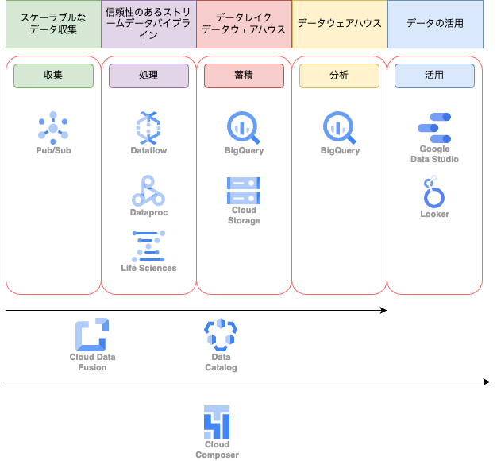
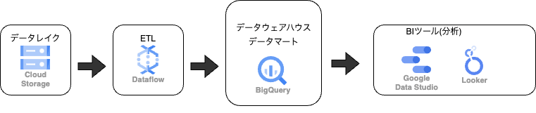

# データ分析のサービス

## 60 データ分析とは

近年注目されているデータ分析とはそもそもどのようなものでしょうか。
GoogleCloudのデータ分析を紹介する前に、注目を浴びるに至った経緯や、データ分析を行うために必要なものについて説明しましょう。

### 近年のデータ分析事情

2010年初頭、ビッグデータという新たなキーワードが注目され始めました。ビッグデータとは、多種多様な出所のデータで構成され、従来のデータベースシステムで処理できる量を超えたサイズを持つデータのことです。
従来のビジネスで利用されてきたデータは、表形式のように構造化されたものがほとんどでした。
しかし現在では、スマートフォンやSNSの急速な普及によって文書や画像、動画などの非構造化データの量が飛躍的に増加し、これらをビジネスで利用することが不可欠になります。
近年、大量のデータを分散させて処理を行う、いわゆる分散型処理技術の進歩により、ビッグデータを扱えるようになりました。また、クラウドベンダーからビッグデータを扱うサービスがていky０おうされるようになったことで、手軽にビッグデータを分析できるようになりました。それを受けて、ビッグデータを利用して分析し、意思決定に役立てるという、いわゆるビジネスインテリジェンス(BI)を活用する企業が増えています。

### データ分析でできること

データ分析を行うと、データに基づいた一貫性のある意思決定を行えます。例えばECサイトの場合、次のような重要な指標を導けます。

* 日別/月別の売り上げ
* ユーザーの登録数推移や定着率
* サイト内のユーザーアクティビティ

上記の例はビッグデータを以前から存在していた指標ですが、蓄積された多様かつ大量なデータを横断的に分析することにより、より新しく詳細な観点からの分析ができるようになります。
また、ビッグデータ技術の登場以降に見出された新たな用途も存在します。

#### 機器の異常検出

IoT機器のセンサーから送信される時系列データをリアルタイムに分析することで、異常を自動で検出して、通知や自動制御を行います。

#### 購入傾向の予測分析

購入傾向を予測する機械学習モデルを用いると、見込み顧客の分析を行えます。
機械学習モデルのトレーニングには、ビッグデータを使用します。

#### ユーザーが投稿した画像の処理

ユーザーが投稿する画像を、画像処理APIを用いて分析することにより、これまでには実現できなかった手法でデータを活用することができるようになりました。
「データ分析が話題になっているから自社でも取り組みたい」「何から初めて良いかわからない」といった場合にさまざまなデータ活用事例から、自社に活かせそうなものを探してみるとよいかもしれません。

### データ分析基盤を選ぶポイント

データ分析を行うのに必要なシステム全般のことをデータ分析基盤と呼びます。このデータ分析基盤を自社で構築する場合、どのような点に注意してシステムを構築すればいいのでしょうか。

* 注意すべきポイント

| 項目 | 説明 |
| --- | --- |
| スケーラビリティ | システムがデータの増加にどれだけ柔軟に対応できるかを示す。 データがテラバイトやペタバイト規模になる想定が必要な場合もある。 |
| 可用性 | システムが停止することなく、どれだけ稼働し続けられるかを示す。 リアルタイム性が重視される分析を行う場合、システムの停止がビジネスに及ぼす影響は大きい。 |
| コスト | システムの構築にかかる費用。投資利益率をあげるため、コストは抑える必要がある。 |
| セキュリティ | 自社の情報が漏洩しないよう、どのようなセキュリティ対策を施せるかを考慮する必要がある |

新規にデータ分析基盤を構築する場合、構成の選択肢としては、オンプレミスやクラウドがあります。
莫大なデータを扱うことと、自前でシステムを構築する際のイニシャルコストや将来の機能拡大を考えると、クラウドの活用がより現実的です。
実際、運用コストやスケーラビリティの観点から、オンプレミスで運用しているデータ分析基盤をクラウドに移行している企業が増えています。

### データ分析を行うポイント

データ分析基盤の構成要素を見ていきましょう。
一般的に、データ分析基盤はデータレイク、データウェアハウス、データマートの3つに分けられます。
データレイクは、未加工のデータをそのまま蓄積する保管場所のことです。構造化・非構造化を問わず、さまざまなデータを組み合わせて分析できるよう、まずは同じ場所に集約しておきます。
データが未加工なままでは分析できないことがほとんどなので、目的に合わせてデータを加工する必要があります。そこで登場するのがETLです。ETLは、Extract/Transform/Loadの略で、データの抽出、変換、書き出しを行う工程のことです。
データレイク内のデータから必要なものをETLで抽出・変換し、データウェアハウスへ書き出します。
データウェアハウスは、さまざまなデータを統合し、分析を行う上で有用な単位でまとめられて蓄積する場所のことです。
ここでまとめられたデータに対し、特定の用途向けに加工したデータをデータマートと呼びます。
データマートをBIツールで可視化して分析すると、ビジネスの意思決定で役に立ちます。

このような、データ分析に関する一連の構成データパイプライン>といいます。
ただし、データパイプラインん要素をすべて異なるシステムで構成するべき、というわけではありません。たとえば表計算ソフトのファイルの組み合わせが、データレイクやデータウェアハウス、データマートを担っていることでしょう。目的に応じて、最適なデータ分析基盤を構築することが大切です。

### まとめ

* データ分析を行うと、データに基づいた一貫性のある意思決定が可能
* データ分析基盤とは、データ分析を行うのに必要なシステム全般のこと
* データ分析には、データレイク、データウェアハウス、データマートの３つに分けられる

## 61 GoogleCloudのデータ分析サービス

Google Cloudが提供するさまざまなサービスを組み合わせることにより、データ分析基盤を柔軟に構築できます。ユースケースを交えつつ、代表的なデータ分析のサービスを紹介します。

### GoogleCloudのデータ分析サービス

GoogleCloudには、スマートな分析を実現するためのサービスが、多数存在します。データウェアハウスサービスであるBigQueryがその代表です。
それぞれのサービスを目的に応じて組み合わせると、データ分析基盤を柔軟に構築できます。

前節で、データ分析基盤を構築するデータレイク、データウェアハウス、データマート、ETL、BIツールというキーワードについて説明しました。
よりイメージしやすいように、GoogleCloudのサービスに置き換えると次のようになります。

データマートは、BigQuery内部に格納したりBIツールに直接出力したりするパターンが考えられます。上記の構成はあくまで一例であり、必ずこのように構築すべきというものではありません。
場合によっては、データレイク・データウェアハウス・データマートの全ての役割をBigQueryが担うケースも考えられます。
つまり、目的に応じてサービスを組み合わせることが大事ということです。

### データ分析基盤のユースケース

GoogleCloudのサービスを組み合わせて分析を行うユースケースを紹介します。

#### ユースケース１ Google Analyticsとほかのデータを組み合わせて分析する

Google Analyticsは、Googleが提供するWebアクセス解析サービスです。GoogleAnalyticsはデフォルトでさまざまな分析が可能ですが、他のデータと組み合わせると、より詳細な分析が行えます。特に有料版のGoogleAnalytics360にはBigQueryへのエクスポート機能が備わっており、よりシームレスな分析が可能です。たとえば、Webページのページアクセスと記事データを合わせて、カテゴリごとの閲覧数や離脱率を導けます。

#### ユースケース２　トランザクションの異常を検出

金融機関にとって、不正な金融取引の発見が遅れることは致命的です。
金融機関のトランザクションをリアルタイムで監視し、不正にいち早く対応するためのシステム構成を紹介します。
バッチまたはストリーミング(継続的にデータが生成されるケース)でDataflowに入力されたデータに対して、トレーニングした予測APIを用いて異常検出を行います。これらによって、短時間でデータを確認できるようになっています。
Vertex AIなどは、GoogleCloud上でAIアプリケーションを構築するための開発プラットフォームです。

### BigQurey以外のデータ分析サービス

ユースケースにも登場した、BigQuery以外のデータ分析サービスについて紹介しましょう。
なお、BigQureyについては次節を参照してください。

#### Cloud Pub/Sub

Cloud Pub/Subは非同期のメッセージングサービスで、ストリーミング分析パイプラインを構築する際のデータの受け口として利用されます。
非同期でデータを扱うことにより、逐次送信される大量のデータをリアルタイムに処理することができます。また、活用用途はそれだけではありません。送信する側受信する側を意識することなく処理を行えるため、受信する側のシステム変更やマイクロサービスのアプリケーション同士の処理を非同期で連携するといった、データ分析以外のユースケースでも用いられます。
Cloud Pub/Subではメッセージを送信する側をパブリッシャー、受信する側をサブスクライバーと呼び、Cloud Pub/Subのエンドポイントを介してメッセージのやり取りを行います。パブリッシャー/サブスクライバーとしては、GoogleCloudのサービスだけでなく、IoT機器やオンプレミスのシステムなど、さまざまな選択肢が考えられます。

### Dataflow

Dataflowは、バッチとストリーミングに対応した、データパイプラインを実行するためのマネージドサービスです。入力されたデータに対し、フィルタリングや加工を行い、指定のサービスへ出力できます。
バッチ処理に加えてCloud Pub/Subと組み合わせたストリーミング処理が強力で、IoT機器から送信されたデータをパイプラインに流し込み、リアルタイムで処理するといった使い方が可能です。マネージドサービスのため、パイプライン処理を行うワーカー(サーバーとなるマシン)の管理などは必要ありません。

### Cloud Dataprep

CloudDataprepは、データクレンジングを行うサービスで、ETLツールの一種です。GUIの操作でデータの検索や変換、異常値の検出などを行えます。
CloudDataprepは米TrifactaのGUIツールとDataflowを組み合わせたもので、裏側ではDataflowが動いています。コーディングせずにGUIでデータを行いたい場合には選択肢になるでしょう

### Cloud Composer

Cloud ComposerはApacehAirfllow(ジョブ管理ツール)のマネージドサービスです。Pythonでコードを記述することで、バッチのジョブを管理できます。
実行スケジュールの設定や、複雑な依存関係のあるデータに対しワークフローを定義することも可能です。

### まとめ

* GoogleCloudにはさまざまなデータ分析関連のサービスが存在する
* GoogleCloudのサービスを組み合わせると、データ分析基盤を柔軟に構築できる
* Webサイトのアクセス分析やトランザクションの異常検出など、幅広いユースケースに対応できる

## 62 BigQuery

GoogleCloudのデータ分析の代表であるBigQueryについて、その特徴や基本的な仕組み、料金体系を紹介します。
また、RDBとの技術的な違いについても説明しましょう。

### BigQueryとは

BigQueryはフルマネージドのデータウェアハウスサービスです。データウェアハウスと名のつくサービスはさまざまな企業から多数提供されており、実装されている機能もサービスごとに異なります。
BigQueryは、マニュアル・バッチ・ストリーミングでのデータインポートやデータを格納するストレージとしての機能、そしてクエリを実行して分析を行う機能など、多くのパワフルな機能を備えています。クラウドサービスなので、それらを少ない準備で利用できます。またBigQueryは、マニュアル・バッチ・ストリーミングでのデータインポートやデータを格納するストレージとしての機能、そしてクエリを実行して分析を行う機能など、多くのパワフルな機能を備えています。クラウドサービスなので、それらを少ない準備で利用できます。またBigQueryは、GoogleAnalyticsやCloudStoragedhのデータを読み込めたり、前述のようにGoogleCloudサービスで一連のデータ分析基盤を構築できたりします。ほかのGoogleCloudサービスと親和性が高く、用途に応じてさまざまな使い方が可能です。

### BigQueryの特徴

BigQueryには、ここまで紹介したもの以外にも、さまざまな特徴があります。

#### 高い処理能力

ペタバイト規模の大規模なデータに対しても高速にクエリを実行できるなど、非常に高い処理能力を誇ります。

#### スケーラビリティ

ストレージ容量が無制限かつ自動でスケールアウトするため、大規模なデータであっても特別な準備は必要ありません。
サーバーノードやストレージの追加といったインフラ作業は不要です。

#### 可用性

SLAで１ヶ月あたり99.99%の稼働時間が保証されています。

#### 低コスト

非常に低いコストで大規模なデータを処理できます。

#### セキュリティ

インフラとして必要なセキュリティ対策が施され、アクセス制御を含む、ユーザーがデータ保護を実現するために必要な機能が提供されています。

#### ほかのGoogleCloudサービスとの連携

ほかのGoogleCloudサービスと親和性が高く、ビジネスのニーズに合わせて柔軟にデータ分析基盤を構築できます。

### BigQueryに問い合わせを行う方法

クエリとは、システムへの問い合わせや処理要求を行う命令のことです。たとえば、一般的なRDBではSQLという言語を用いて、データベースに対する処理要求を行います。
BigQueryにもRDBと同様にスキーマを持つテーブルという概念が存在し、クエリもSQLで記述します。

BigQueryには標準SQLとレガシーSQLという２種類のSQLが存在します。
標準SQLは、RDBで用いられるSQLと基本的には同じ構文で用いられます。ただし、一般的なRDBのSQLとは、細かな点で仕様の異なる場合があるため、公式ドキュメントを確認しつつ記述することをおすすめします。
レガシーSQLは標準SQLがサポートされる前に使われており、BigQuerySQLという独自の構文で記述します。
公式ドキュメントやSQLサンプルを参照する際は、どちらのSQLなのかを必ず確認するようにしましょう。

### BigQueryとRDBの違い

BigQueryは、RDB同様にテーブルを持ち、SQLによってデータの処理要求を行います。では、どのような点がRDBと異なるのでしょうか。
1つ目は、カラム型ストレージである点です。必要なカラムにのみアクセスできるため、データ走査を最小化できます。
2つ目は、ツリーアーキテクチャである点です。クライアントから受け取ったクエリの処理をツリー構造の処理に分解して、複数のサーバーに分散することで、大規模な分散処理を実現しています。
また、NoSQLのように、パフォーマンス向上を目的としてデータを非正規化することも可能です。BigQueryはSQLの構文をサポートしつつ、NoSQLの特徴も併せ持つハイブリッドなシステムと言えます。これらの特徴によって、BigQueryは大規模なデータを効率よく処理できるため、データ分析や機械学習に適したサービスとなっているのです。
一方で、RDBが行う行単位でのデータ処理は、BigQueryが苦手とするところです。そのため、行単位での更新や削除が頻繁に行われるデータを格納するには向いていません。データベースを選定する際は、データ自体の性質や扱う目的を考慮することが大切です。

### BigQueryの料金

BigQueryの料金は、ストレージ料金と、オペレーションの合計です。
ストレージ料金は、東京リージョンで1GBあたり`$0.023`なので、たとえば１テラバイトのデータを格納しても、１ヶ月あたり`$23`ですみます。データ追加にかかる料金は、ストリーミングでのデータ挿入でなければ無料です。さらに、毎月の無料分もあるため、非常に安価に利用できます。なお、クエリ実行にかかる料金を抑えるためのポイントは、後ほど解説します。

| 種別 | 対象 | 料金 | 詳細 |
| --- | --- | --- | --- |
| ストレージ料金 | アクティブストレージ | $0.023/GB | 毎月10GBまで無料 |
| ストレージ料金 | 長期保存 | $0.016/GB | 毎月10GBまで無料。90日間編集されていないテーブルが対象 |
| オペレーション機能 | ストリーミング挿入 | $0.012/200MB | 通常、BigQueryへのデータの読み込みは無料。ストリーミングで挿入されるデータに対しては料金が発生する。 |
| オペレーション料金 | クエリ(オンデマンド) | $6.00/TB | 毎月1TBまで無料 |

### まとめ

* BigQueryはフルマネージドのデータウェアハウスサービス
* データ分析をはじめとするさまざまな機能を少ない準備で利用できる
* SQLを用いて処理要求を行う
* ポイントを押さえれば安価に利用できる

## 63 BigQueryを使用する流れ

BigQueryは、GoogleCloudコンソールをはじめとするいくつかの方法で使用できます。
ここではGoogleCloudコンソールからの利用を想定し、BigQueryを使用する流れと、操作する上で押さえておくべき用語を紹介します。

### BigQueryの操作

BigQueryの操作は大きく、データを準備する操作と、クエリを実行する操作に分かれます。
データを準備する操作とは、データセットとテーブルを作成し、テーブルにファイルをアップロードなどでデータを挿入する操作のことです。BigQueryにはデータ挿入せずに、CloudStorageなどの外部データソースを使用する方法もあります。
一方、クエリを実行する操作とは、用意したデータに対して問い合わせを行い、データの並び替えやグループ化など、意図した処理を行って結果を取得することです。
なお、データの準備やクエリの実行といった操作は、GoogleCloudコンソール以外にもさまざまな方法で行えます。

### BigQueryの用語

BigQueryを操作する上で、押さえておくべき用語を紹介します。

| 項目 | 内容 |
| --- | --- |
| プロジェクト | GoogleCloudのプロジェクトのこと。BigQueryで管理するデータセット・テーブル・ジョブはプロジェクトに紐づく |
| データセット | テーブルやビューのことを指す。データセットを作成すると、テーブルを作成することが可能になる。 |
| テーブル | データを格納した行と列の集合。各列にどのような値が入るかを示すスキーマを持つ |
| ジョブ | クエリやインポート、エクスポート、データのコピーといった処理の単位のこと |

### BigQueryを使用する流れ

BigQueryを使用するにはまず、GoogleCloudコンソールからSQLワークスペースを開いて、データセットを作成する必要があります。
続いて、データセットにテーブルを作成し、データを挿入します。
BigQueryの操作は、GoogleCloudコンソールのほか、bqコマンドラインツール(BigQuery専用のコマンドラインツール)やクライアントライブラリ(プログラムからBigQueryを操作するもの)が利用できます。
データが準備できたら、テーブルにたいしてクエリを実行できます。

### BigQueryでよく使われる機能

BigQueryのさまざまな機能のなかでも、よく使われる機能を紹介します。

#### 一般公開データセット

データ分析をするにはまず、データを収集することが必要です。
GoogleCloudでは、GoogleCloudMarketplaceに多数のカテゴリやジャンルのデータセットが公開されているので、使えるデータがないか確認しましょう。
これらのデータセットは、BigQueryで活用できます。

#### クエリエディタ

クエリエディタは、クエリおw入力してじっっこうできる機能です。クエリを入力した時に構文解析が行われるため、明らかに実行できないクエリについては構文エラーが表示されます。
Tabキーで補完が効きます。

#### クエリ結果ビュー

クエリエディタでクエリを実行すると、クエリ結果ビューでデータを閲覧できます。
「結果の保存」を押すと、CSVやJSONなどの拡張子で分析結果をダウンロードできます。

### まとめ

* BiqQueryの操作は大きく、データを準備する操作と、クエリを実行する操作に分かれる
* BigQueryを使用するには、データセットとテーブル、データの挿入が必要

## 64 BigQueryのベストプラクティス

BigQueryでは大量のデータに対してクエリを実行するため、BigQueryの料金に対して不安を抱く人が多い。
コストに対する不安を払拭すべく、コストの抑制方法を解説する。

### BigQueryの料金は工夫次第で抑えられる

BigQueryには、ほかのパブリッククラウドのデータウェアハウスサービスにはない「コンピューティングリソースに対する固定コストがない」「チューニング不要のためそのための人的コストが必要ない」といったメリットがあります。
その一方で、BigQueryのクエリ料金は従量課金制であり、クエリが参照したデータサイズと、クエリ結果に含まれるデータサイズによって算出されます。
そのため、「予想外のコストが発生していた」ということがあります。

### パーティションを指定してクエリを実行する

パーティションと呼ばれるセグメントに分割したテーブルにたいしてクエリを実行するとコストが抑えられます。
クエリ料金の「クエリが参照したデータサイズ」を抑えられるためです。

### パーティションの指定を必須にする

注意を払っていても、パーティションを指定せずに実行してしまうことはあります。
しかし、データサイズがTBを超えるテーブルでのうっかりミスは防ぎたいものです。
「パーティションの指定がないクエリは実行しない」という制約をつけることによって、エラーを発生させることができます。

### クエリのキャッシュを有効にする

BigQueryはデフォルトで、クエリのキャッシュが有効になっています。
そのため同じクエリであれば、クエリの料金は発生しません。

### ドライランでチェックを行う

クエリを実行する前にドライランを実行可能です。
ドライランを実行すると、クエリを実行した場合の課金バイト数やクエリのパフォーマンスを確認できます。
ドライラン実行によって、クエリコストが高いことが判明した場合は、クエリのチューニングやクエリの分割をするとコスト削減できます。

### BigQueryの使用状況を監視する

CloudMonitoringを使うとBigQueryの課金バイト数をモニタリングできます。
しきい値を設定してアラート通知する仕組みを実装すれば、コストの高いクエリを実行しても検知して対応してくれます。

### まとめ

* BigQueryの料金は工夫次第で抑えられる
* パーティションを指定してクエリを実行すること
* select句に指定するカラムを最低限にすること

## 65 BIツール

収集したデータをかつようするのに、グラフなどでデータの特徴を視覚的にわかりやすくできるBIツールが必要な場合があります。
GoogleCloudで使えるBIツールについて紹介しましょう

### BIツールとは

BIツールとはデータの抽出や加工、そのデータを可視化する機能を備えたツールのことです。
BIツールによって生成されたレポートは、企業の意思決定のために使用されます。
BIツールを使うと、データをグラフなどで視覚的に掴みやすいというメリットがあります。

### Googleデータポータル

Googleデータポータルは、Googleが提供するBIツールです。
GoogleアカウントやGoogleWorkspaceのアカウントを持っていれば使用可能です。
日本では商標の問題でGoogleポータルという名称ですが、日本以外ではGoogle Data Studioという名称です。
Googleデータポータルを使用してデータ分析を行う場合、ライセンスやレポートを管理する必要がなく、無料で使用できます。
GoogleWorkspaceをグループウェアとして採用している場合、組織や部門・グループ単位でレポートの共有が可能です。
レポートを、メールに添付して送信することや、Googleサイト(Webサイトを作成できるツール)に埋め込むこともできます。

### レポートの作成にはデータソースの接続が必要

Googleデータポータルでレポートを作成するには、まずデータの保存先を用意します。
例えば次のようなデータを扱えます。

* BigQuery
* CloudStorage
* CloudSpanner
* CloudSQL
* GoogleAnalytics
* Googleスプレッドシート

なお、GoogleデータポータルはGoogleCloud以外のオンプレミス環境にあるデータも、データソースとして扱えます。

### BigQuery BI Engine

BigQuery BI Engineは、レポートで参照しているBigQueryのテーブルが更新されると、自動でキャッシュを作成するレポートサービスです。
BigQuery BI Engineを使うと、キャッシュにより数秒でレポートを表示できるので、BigQueryをデータソースとする主要なBIツールでストレスなく閲覧や分析ができます。

### Looker

GoogleCloudはLookerを買収しました。
Lookerはデータ分析からデータ活用までをつなげる高機能なデータモデリングのサービスです。
従来のBIツールとしての用途だけでなく、可読性の高いモデリング言語であるLookMLを使用することで、接続するデータソースによって異なるSQL仕様を吸収します。
またLookMLコードをGitHubで管理すれば、組織の部門ごとに異なっていた指標を一元管理できます。

### まとめ

* Googleデータポータルは、Googleが提供するBIツール
* BigQuery BI Engineは、BigQueryのテーブルが更新されると、自動でキャッシュを生成するサービス
* Lookerは、データ分析からデータ活用までをつなげる高機能なデータモデリングサービス

